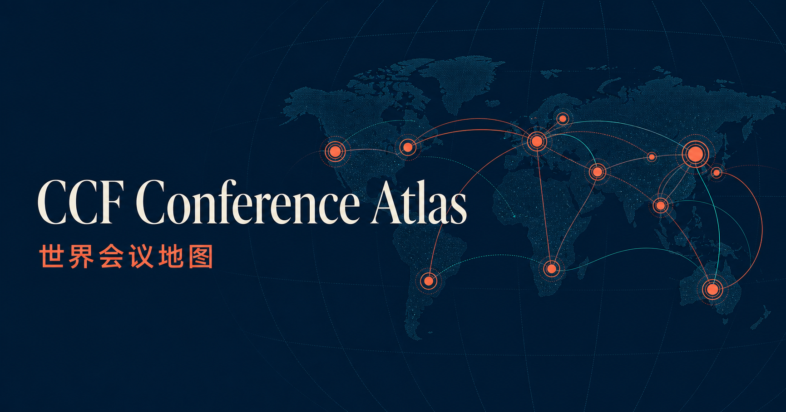

  

<h1 align="center">CCF Conference Atlas</h1>

  在世界地图上查看计算机学术会议 
  Explore computer science conferences on a world map

  <a href="https://github.com/ccfddl/ccf-deadlines/tree/main/conference">会议数据 / Conference data</a>
  ·
  <a href="https://github.com/nvkelso/natural-earth-vector/blob/master/geojson/ne_110m_admin_0_countries.geojson">国家边界 / Country boundaries</a>

> 国家边界数据来源：[Natural Earth 1:110m Admin 0 Countries](https://github.com/nvkelso/natural-earth-vector/blob/master/geojson/ne_110m_admin_0_countries.geojson)，采用 Public Domain 许可。网站在展示层统一名称、归属和配色。
>
> Country boundary source: [Natural Earth 1:110m Admin 0 Countries](https://github.com/nvkelso/natural-earth-vector/blob/master/geojson/ne_110m_admin_0_countries.geojson), released into the public domain. The site normalizes names, affiliations, and colors in its presentation layer.

## 中文

CCF Conference Atlas 是一个用于浏览全球计算机学术会议的静态网站。首页以全球学术网络为主题，向下滚动即可进入交互式三维地球。

### 网站功能

- 使用不同色块区分国家和地区，并保留真实的地理边界。
- 在会议举办地直接显示标记和名称，点击后可以查看会议全称、研究领域、评级、日期、地点、投稿截止时间和官方网站。
- 默认展示本月及之后的会议。浮动工具栏支持按研究类型、年月范围、大洲以及国家或地区筛选。
- 可以直接通过 `index.html` 打开。离线时仍可查看内置的国家边界和会议数据，联网后会加载带有国家、地区和城市名称的地图瓦片。

### 数据来源

会议信息来自 [ccfddl/ccf-deadlines](https://github.com/ccfddl/ccf-deadlines/tree/main/conference) 维护的 YAML 数据。本站会整理其中的会议名称、研究领域、评级、日期、地点、官网和投稿截止时间，并将地点转换为地图坐标。上游记录可能存在缺失或变动，请以会议官方网站为准。

地图中的国家和地区边界直接基于 Natural Earth 的 [1:110m Admin 0 Countries GeoJSON](https://github.com/nvkelso/natural-earth-vector/blob/master/geojson/ne_110m_admin_0_countries.geojson)。这份公开领域数据已经随网站保存在 `country-data.js` 中，页面不需要联网下载边界。在线地图瓦片由 [CARTO](https://carto.com/attributions) 提供，地理信息基于 [OpenStreetMap](https://www.openstreetmap.org/copyright) 数据。

## English

CCF Conference Atlas is a static website for browsing computer science conferences around the world. The landing page presents a global academic network, followed by an interactive 3D globe.

### Features

- Countries and regions use distinct colors while retaining real geographic boundaries.
- Each conference appears at its host location with a visible marker and label. Selecting it reveals the full name, research area, ranking, dates, location, submission deadlines, and official website.
- The default view includes conferences from the current month onward. A floating toolbar filters them by research area, month range, continent, and country or region.
- The website can be opened directly from `index.html`. Built-in country boundaries and conference data remain available offline, while an internet connection adds map tiles with country, region, and city labels.

### Data sources

Conference information comes from the YAML files maintained by [ccfddl/ccf-deadlines](https://github.com/ccfddl/ccf-deadlines/tree/main/conference). The site processes conference names, research areas, rankings, dates, locations, official websites, and submission deadlines, then converts location text into map coordinates. Upstream records may be incomplete or change over time, so refer to each conference's official website for final details.

Country and region boundaries come directly from Natural Earth's [1:110m Admin 0 Countries GeoJSON](https://github.com/nvkelso/natural-earth-vector/blob/master/geojson/ne_110m_admin_0_countries.geojson). This public domain dataset is stored locally in `country-data.js`, so the page does not need a network connection to load boundaries. Online map tiles are provided by [CARTO](https://carto.com/attributions), with geographic information from [OpenStreetMap](https://www.openstreetmap.org/copyright).
